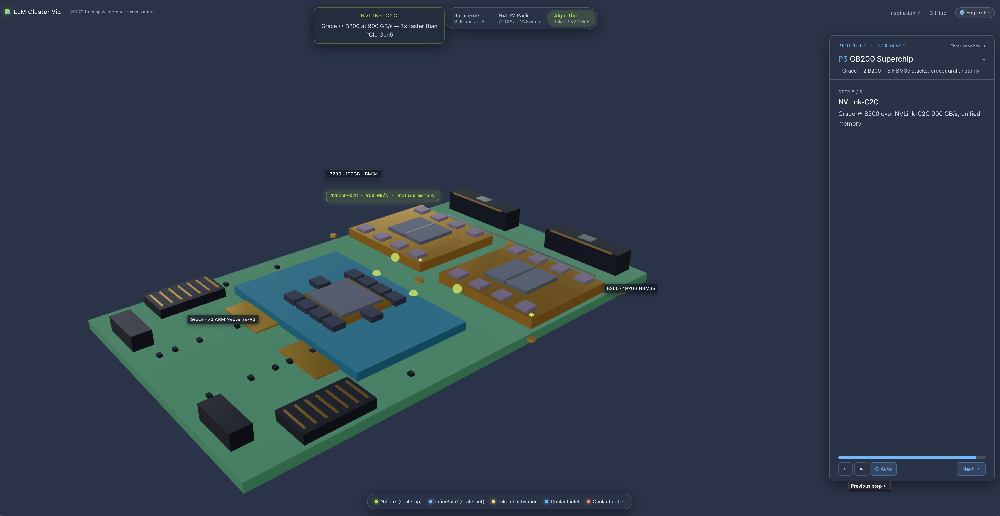
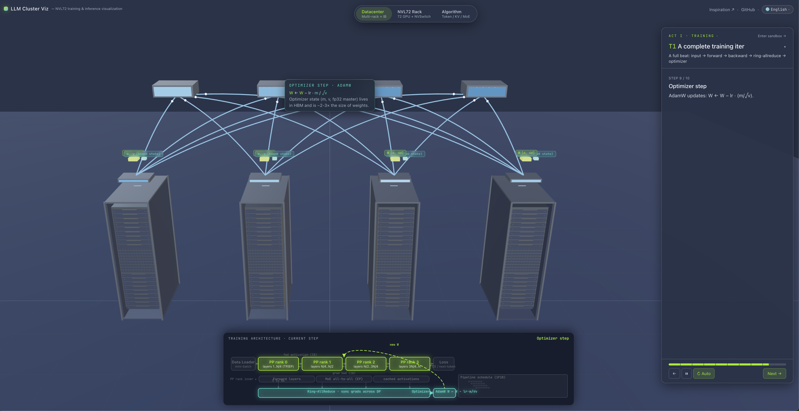
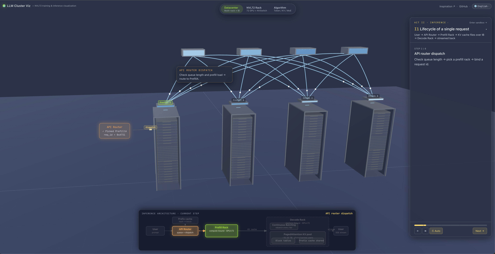
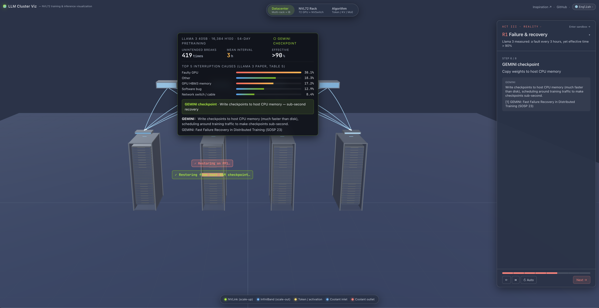

# LLM Cluster Viz

> A 3D film about one ChatGPT reply and one training run — except you can walk into it.

An open-source, interactive visualization that uses three zoom levels — **datacenter → NVL72 rack → chip & algorithm** — to answer one question:

**When you send "hello" to a large language model, what actually happens on the hardware?**

**[Open the live demo → auxten.com/llm-cluster-viz](https://auxten.com/llm-cluster-viz/)**

<p align="center">
  
  
</p>
<p align="center">
  
  
</p>

---

## What it tries to explain

You've probably heard these words: NVLink, InfiniBand, KV cache, MoE, pipeline bubble, continuous batching…

Each one is a long blog post on its own. Put together, they're a textbook. This site takes a different approach:

- No equations first — just **a 3D datacenter you can orbit around**
- No jargon first — just **data flying between racks in front of your eyes**
- No block diagrams first — just **a trip inside the HBM of a single GPU**

By the end you'll have a gut-level "oh, so *that's* what it looks like" feeling for things like:

- Why does training a frontier model take thousands of GPUs, and still fail every 3 hours?
- Why did NVIDIA make "one machine" (NVL72) as big as 72 GPUs?
- Why does industry split inference into two different kinds of machines (prefill vs. decode)?
- How did Llama 3 survive 419 interruptions across 54 days on 16,384 H100s and still finish training?

---

## What you'll see

The tour is **4 acts, 10 chapters** — a short documentary. Each chapter is 30 seconds to 2 minutes. Watch front to back, or jump around.

**Act 0 · Prologue — a tour of the hardware**
Zoom from a wide shot of the datacenter all the way down to a single HBM stack.

- P1 · Datacenter overview — 4 NVL72 racks, 288 Blackwell GPUs
- P2 · GB200 Superchip — 1 Grace CPU + 2 B200 GPUs + 8 HBM3e stacks

**Act 1 · Training — how a model actually gets trained**
One full training iteration, from input batch to weight update.

- T1 · The whole training iteration end to end
- T2 · Pipeline bubble — why does a naive pipeline idle 38% of the time?
- T3 · MoE all-to-all — 256 experts across 64 GPUs, and the shuffle that makes it work

**Act 2 · Inference — what happens when you send a prompt**
The full lifecycle of one request, from browser to streaming tokens.

- I1 · Request lifecycle (router → prefill → KV transfer → decode → SSE)
- I2 · Prefill internals — why the whole prompt computes in one shot
- I3 · Decode & continuous batching — how thousands of users share one GPU
- I4 · KV cache budget — why long context is expensive

**Act 3 · Reality — when the ideal meets the physical world**

- R1 · Failures & recovery — hardware breaks every 3 hours, and training still gets >90% effective time

---

## How to watch

Just open the site. No sign-up, no GPU needed, nothing to install.

- **Mouse / touch** — orbit, pan, zoom the 3D scene freely
- **Keyboard** — `←` / `→` or `j` / `k` to step, `Space` to pause/resume
- **Language switcher** (top right) — English, Chinese (Simplified / Traditional), Japanese, Korean, Spanish, Portuguese, Italian, French. Nine languages.
- **Sandbox mode** — prefer to explore without a script? Click "Enter sandbox" in the bottom right
- **Mobile** — on small screens some chapters fall back to 2D diagrams to keep things readable

Every step has a short caption. Every number you see on screen (130 TB/s, 419 interruptions, >90% effective time…) comes from an NVIDIA whitepaper or a published paper — citations are always one click away.

---

## Who this is for

- **Engineers, PMs, students** who want to actually understand how large models run
- People preparing for (or giving) **LLM-infrastructure interviews**
- Anyone who watched a Jensen keynote and wondered what that rack actually *is*
- Anyone who needs a **demo-ready deck** for an internal "LLM infra 101" talk

You don't need CUDA, PyTorch, or distributed training experience. If you can use a mouse, you're qualified.

---

## Run it locally

If you want to tweak it, add a chapter, or run it offline:

```bash
git clone https://github.com/auxten/llm-cluster-viz.git
cd llm-cluster-viz
npm install
npm run dev
```

Open `http://localhost:5173`. For a production build, `npm run build` — output lands in `dist/`.

**Tech stack**: React 19 + TypeScript + Three.js (via @react-three/fiber) + Tailwind + Vite. Pure frontend, no backend required.

---

## Inspiration

[Dwarkesh Patel's interview with Reiner Pope](https://www.dwarkesh.com/p/reiner-pope) — a brilliant verbal walkthrough of LLM inference on real hardware. This site is the visual companion to that conversation, extended to cover training, MoE, and failure recovery.

Key references:

- NVIDIA GB200 NVL72 whitepaper and Blackwell architecture docs
- Meta · *The Llama 3 Herd of Models* (interruption statistics)
- DeepSeek-V3 technical report (MoE design, EP domain sizing)
- vLLM · *Efficient Memory Management for LLM Serving with PagedAttention*
- Mooncake · disaggregated prefill/decode serving in production
- GEMINI · fast failure recovery via in-memory checkpointing
- ReCycle · elastic pipeline takeover

---

## License

MIT
